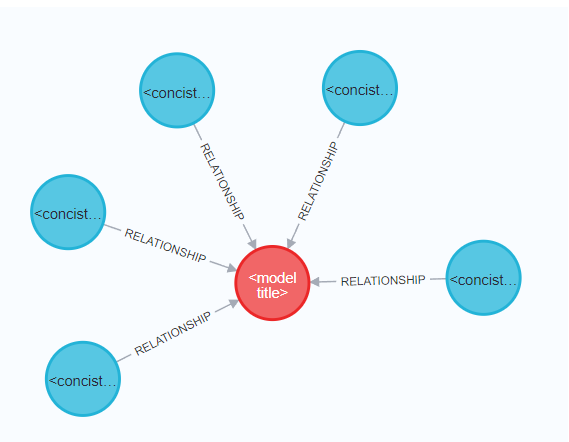

- Java 11
- mongoId уникально для всех ModelNode, у ClassNode свой уникальный mongoId
- Отношения устанавливаются при сохранении ModelNode, если указан classMongoId существующей ClassNode
- У ClassNode к ModelNode отношение Многие-к-одному
- Примеры запросов в [ModelRequests.http](ModelRequests.http) и [ClassRequests.http](ClassRequests.http)

